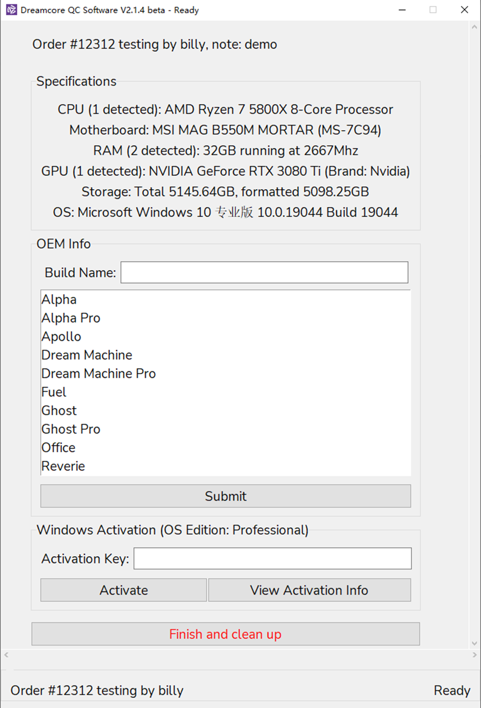

# Dreamcore QC Software

## ⚠️Notice

This repository partially open-sources a Python-based software that runs automated quality-control processes on a custom-built PC. It was originally built for Dreamcore, a custom PC company in Singapore.

Code in this repository are not meant to be ran directly, as it requires other supporting files that I cannot/do not have the permission to open-source. It serves as a reference implementation to interacting with many Windows system APIs.

Code in this project can modify critical system settings of your PC, including but not limited to drivers, registry, Windows licensing, installing/uninstalling software etc. You should not execute any part of the code without knowing clearly what are the implications.

As this project was done quite a while ago, the code may not work with the latest version of libraries. It was tested on Python 3.10 on Windows 10/11. Last tested on 3rd March 2022.

## Introduction

This is an end-to-end PC set-up and quality control (QC) software, covering from fresh Windows installation all the way to ready-to-ship machines.

The software was designed with efficiency, parallelization, automation and traceability in mind. Human attention is only required a few times throughout the process, the rest of the time it runs well on its own.

The software is designed to be beginner-friendly. It has extensive and clear logging messages and pop-up alerts whenever something wrong happens. It also sports an easy-to-use GUI.

With built-in Telegram bot support and potential support for various online work progress tracking tools like Google Sheets and Monday.com, it is ready to be integrated into an online-centric business operation model.

A full run of the QC process takes about half the time compared to doing it manually from preliminary measurements done at Dreamcore. The timing could vary depending on the specific workflow and Internet connection speed.

The ultimate purpose of this software is to save time and cost for both the company and the consumer, allowing technicians with less experience to perform the then complicated process and unleashing experienced manpower to more critical roles in the company. This is especially important in a man-powered limited time today. It can be further refined into a consumer self-testing tool that aids in remote customer support and troubleshooting for more obvious issues like overheating, potentially saving time and effort for the after-sales team.

## Features

Note: The software assumes to be first launched in Windows Audit mode from a USB thumb drive. The following features are listed in the order of the actual QC SOP. For full step-by-step documentation, please refer to [Dreamcore QC Documentation.pdf](Dreamcore%20QC%20Documentation.pdf).

1. Detects system hardware and displays them in the GUI.
2. Allows for a tester to fill in order details for traceability and record.

3. Installs all drivers needed and reports on failing or incompatible drivers.
    - Intel and AMD chipset drivers
    - Realtek, Intel and Marvell LAN (Ethernet) drivers
    - MediaTek and Intel WiFi and Bluetooth drivers
    - Intel, AMD, Nvidia GPU drivers. Installs Nvidia Quadro GPU driver if detected a Quadro GPU
    - Realtek Audio driver

4. Checks for problematic devices in device manager.
5. Downloads and installs all available Windows Update.
6. Tests WiFi and Bluetooth functions, if any (requires a connectable WiFi)
7. Installs 3DMark and DLCs for later use
8. Sets system timezone and syncs system time with Internet
9. Sets system power plan to High Performance
10. Detects and initializes all unformatted disks, then format them to the max capacity and assign the next available drive letter
11. Assists in testing USB ports
12. Assists in testing Audio jacks
13. Records all problematic or failed tasks into a checklist

14. Runs Passmark BurnIn Test V9.2 and automatic selection of disks to stress test (does not stress test customer provided hard drive)
15. Runs Cinebench R20 and records score
16. Runs 3DMark (with demo skipped to save time) for multiple runs and records scores
17. CPU temperature and power draw and multi-GPU temperature monitoring via HWINFO, plotting data in graphs

18. Runs Karhu software RAM Test and automatically sets threads and test size
19. Uninstalling and clean up of benchmark software and logs
20. One-click Windows OEM Information setting and wallpaper setting
    - Manufacture and model name info
    - Manufacturer support URL
    - Manufacturer logo

21. Windows Activation (with valid activation key provided by tester)
22. Restore point creation (right before shipping)
23. Telegram bot integration: sends messages at any step (currently sends message when human attention is needed); maintains a constantly updated todo-list for each order that records problematic or failed tests; sends all benchmarking scores with order no for record purpose and future use.
    
    

## Technical Details

- Usage: this software can be packaged using PyInstaller into a self-contained executable, suitable to be run on a fresh Windows installation without Internet.
- GUI is written in Tkinter, a built-in Python library.

## Why?

I worked at Dreamcore as a part-time PC builder back in 2020. I witnessed the COVID-19 induced surge in PC demands, and also inefficiencies in their processes. I coded a basic Windows batch script do aid with driver installation, but it was way too limited and unstable due to Windows batch file limitations. It also did not cover the process end-to-end. 1 year after I left, I made this.

As this project is now done and dusted, I want to record what I have done over probably the most fun time of my high school years. It was during the year before high school graduation examination (A-levels). I did this as a coping mechanism under academic stress, but it turned out to be a great experience working with such a wide range of low-level system APIs and also my first time doing GUI programming. It ended up way better than I planned.

Dreamcore is currently running this in their daily workflow.